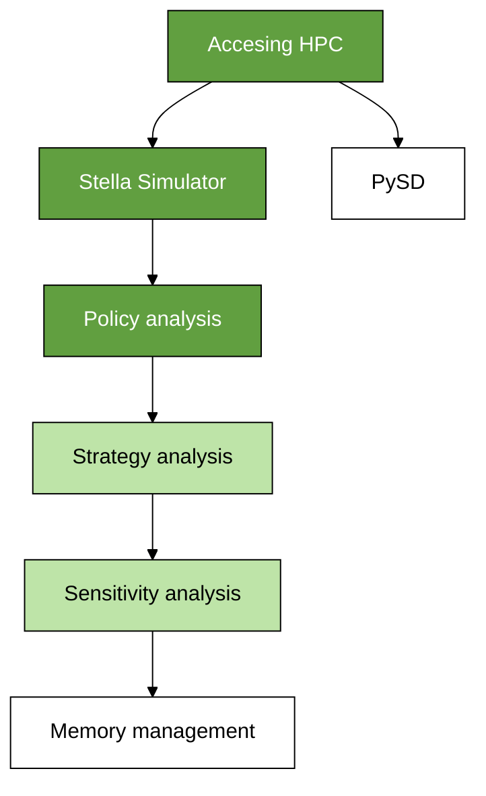

# Introduction

The System Dynamics for Data Sciences (SD4DS) collection of exercises provides a set of skill building exercises for running and analyzing system dynamics computer simulation models using the Case Western Reserve University's (CWRU) High Performance Computing (HPC) cluster.  Each exercise is organized as a GitHub repository that can be cloned on users' local directory on the HPC with worked examples, sample code, and system dynamics models. 

# Basics

Each exercise is organized as a GitHub repository. Each exercise provides an overview, step-by-step instructions, links to YouTube videos demonstrating the steps for replicating the exercises, and any additional resources. Since many tasks can be easily accomplished in R or Python, whenever possible, examples of both are provided. 

# Overview of exercises

This section provides an overview of the exercises. 

| Topic  | R     | Python | 
|:-------| :---: | :---:  |
| [Accessing HPC through RStudio and Jupyter interactive sessions](https://github.com/CBSDLab/SD4DS_1-0) | Yes | Yes |
| [Running models using Stella Simulator](https://github.com/CBSDLab/SD4DS_1-5) | Yes | No |
| [Setting up and running a policy Analysis](https://github.com/CBSDLab/SD4DS-policy-analysis) | Yes | No |

# Roadmap

# General resources

* For general information and tutorials on using the CWRU HPC clusters, starting interactive sessions, and submitting/managing batch jobs, see https://sites.google.com/a/case.edu/hpcc/. 
* For general resources on the git versioning system and commands, see https://git-scm.com/. For an  introduction to git basics and version control, see https://git-scm.com/video/what-is-version-control. The *Pro Git* book. provides an excellent overview starting with a basic tutorial and moving onto more sophisticated features. The book can be downloaded for free from https://git-scm.com/video/what-is-version-control.
* The free version of Anaconda supporting RStudio, Python, Jupyter, JupyterLab, and many other packages can be downloaded from https://www.anaconda.com/. 
* The free version of RStudio integrated development environment (IDE) can be downloaded from https://www.rstudio.com/products/rstudio/download/.  

# Acknowledgements

This work made use of the High Performance Computing Resource in the Core Facility for Advanced Research Computing at Case Western Reserve University and supported by the Provost Think Big initiative.  
